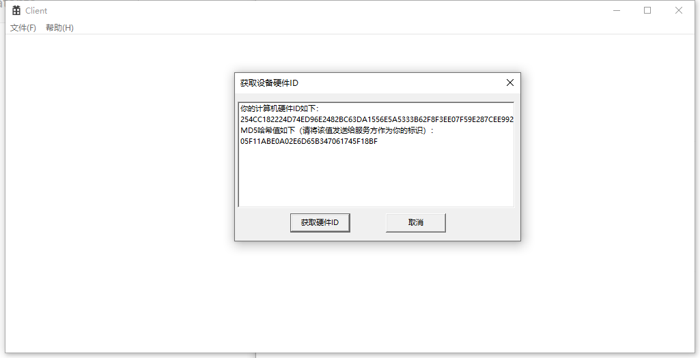
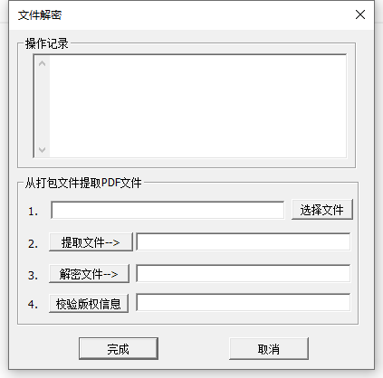
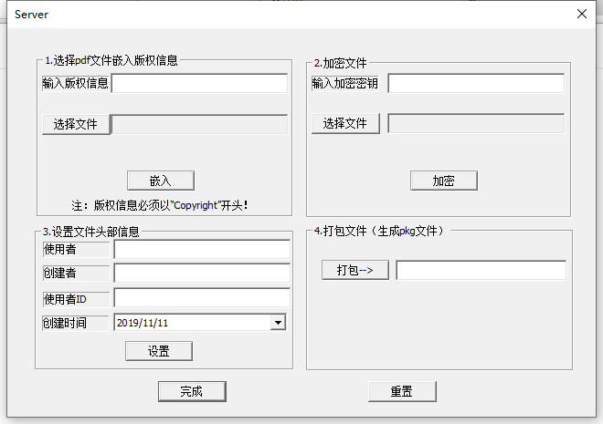

# PdfDRM_basic
A simple DRM prototype system of PDF files, designed with C/C++.

## What you can learn from this repo.

- The basic GUI-program with Windows SDK.
- How to get your computer individual information by the MSDN-API.
- How to embed your copyrights into PDF files, this point is encouraged by this [site]( https://patents.google.com/patent/CN102622562B/fi ) 
- How to import the miracl library to your project.
- The basic use of Encryption Algorithm SM2, SM3, SM4.

## What you should attention.

- you should see the gitignore file before you compile the code.
- .sln file is related to the Visual Studio, so you just open this file with that Application, then most of things get done.
- After you first compile, you will get a cpuid.txt in curr directory, just ignore it.

## Screenshots

### Client

### Server

- - -

Have fun with your exploring! :)